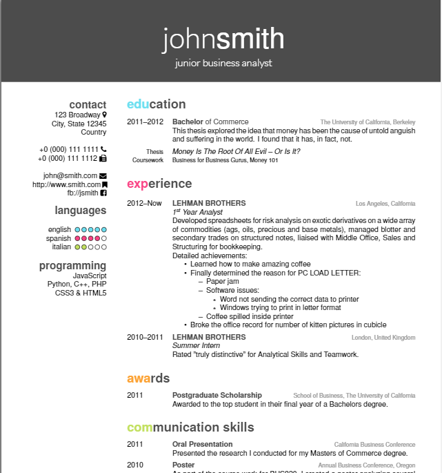

[](https://github.com/JesperDramsch/friggeri-cv-boosted/blob/master-pdf/)
# About
Modification of the friggeri-cv Latex template. Original was typeset in Helvetica and using colors inspired by Monokai. Modification uses extended colour palette and a choice of libre fonts.

Uses TikZ for the header and some pretty tricks, XeTeX and fontspec to use fonts, biblatex to print publications and textpos for the aside.



# Features:

* Two Column
* Information-dense
* Fontawesome Icons
* Skill Scoring
* Publication List
* Multiple Fonts
* Student-Friendly

# Options
Several class options are available:

## Style
* `a4paper`: Changes layout to A4.
* `nocolors`: Changes to black and white, leaves headers.
* `print`: Changes to black and white, removes header to minimize ink usage.

## Fonts
* `heros`: Standard TexGyre Heros font (introduced as alternative to Helvetica Neue by Sharelatex)
* `alegreya`: [See Example](https://fonts.google.com/specimen/Alegreya+Sans) Alegreya was chosen as one of 53 "Fonts of the Decade" at the ATypI Letter2 competition in September 2011, and one of the top 14 text type systems.
* `merriweather`: [See Example](https://fonts.google.com/specimen/Merriweather+Sans) Merriweather Sans is traditional in feeling despite the modern shapes it has adopted for screens.
* `nunito`: [See Example](https://fonts.google.com/specimen/Nunito) Nunito is a well balanced sans serif typeface superfamily
* `roboto`: [See Example](https://fonts.google.com/specimen/Roboto) Roboto has a dual nature. It has a mechanical skeleton and the forms are largely geometric. At the same time, the font features friendly and open curves. 

# Usage
Replace all things that need replacing.

Adding new things is easy:
Check Dante for [New Icons in Fontawesome](ftp://ftp.dante.de/tex-archive/fonts/fontawesome/doc/fontawesome.pdf)

## \score{n}
One input integer from 0-5 (inclusive).
### Example:
```
\score{3}
```

### Effect
Will fill number of circle out of five circles to indicate skill level.

## \courseentry{}{}{}{}{}{}
Six inputs

1. Years
1. Degree
1. University
1. Context
1. Thesis
1. Courses

### Example
```
\courseentry
{2011--2012}
{Bachelor {\normalfont of Commerce}}
{The University of California, Berkeley}
{This thesis explored the idea that money has been the cause of untold anguish and suffering in the world. I found that it has, in fact, not.}
{Money Is The Root Of All Evil -- Or Is It?}
{Business for Business Gurus, Money 101}
```

### Effect
Creates a special education-focused \entry in the the entrylist environment.
